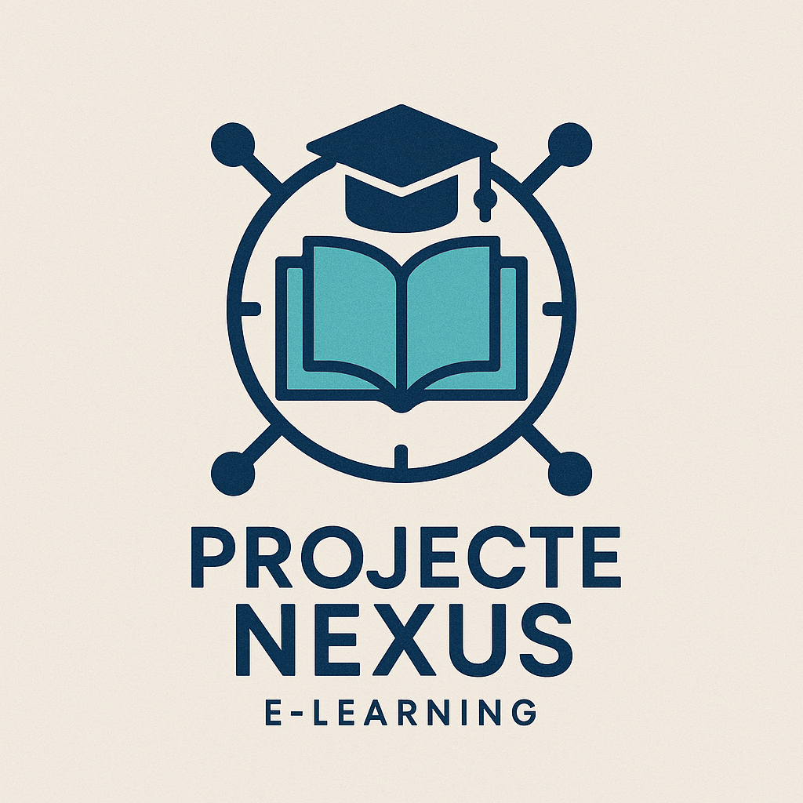

# projecte Nexus

## Desplegament integral d'infraestructura segura per a entorns d'e-learning

## Autor

Nom: Pol

Formant grups de treball: Pol C. i Marc M.

## Contingut del projecte

- [**Tasca 1 (T01)**](./T01)
- [**Tasca 2 (T02)**](./T02)
- [**Tasca 3 (T03)**](./T03)
- [**Tasca 4 (T04)**](./T04)
- [**Tasca 5 (T05)**](./T05)
- [**Tasca 6 (T06)**](./T06)
- [**Tasca 7 (T07)**](./T07)
- [**Tasca 8 (T08)**](./T08)
- [**Tasca 9 (T09)**](./T09)
- [**Tasca 10 (T10)**](./T10)
- [**Tasca 11 (T11)**](./T11)
- [**Tasca 12 (T12)**](./T12)
- [**Tasca 13 (T13)**](./T13)
- [**Producte 1 (P01)**](./P01)
- [**Producte 2 (P02)**](./P02)
- [**Producte 3 (P03)**](./P03)
- [**Producte 4 (P04)**](./P04)
- [**Producte 6 (P06)**](./P06)

## Descripció del projecte

Projecte Nexus vol posar en marxa una plataforma de formació E-learning pròpia, orientada a cursos per a tècnics informàtics i demana que aquesta plataforma es construeixi sobre una infraestructura de servidor eficient, sostenible i amb costos controlats.

Per aquest motiu, Projecte Nexus encarrega al vostre equip tècnic (vosaltres) l’estudi, desplegament i presentació d’una solució completa de servidor, adequada a les necessitats del client i al context real d’una petita o mitjana organització.

Al següent enllaç pots trobar l'enunciat complet del projecte [accés al projecte Nexus](https://docs.google.com/document/d/1dyntLKYDdo1CpgM7ZmHbXXD5VhMYAe9-/edit?usp=sharing&ouid=104728425662496836733&rtpof=true&sd=true)

## Guies Git i GitHub

- [Introducció a Git i GitHub](https://github.com/SMX2n/IntroGitHub)
- [Control de versions: Git](https://github.com/SMX2n/ControlVersions)
- [Guia GitHub Classroom](https://github.com/SMX2n/guia-github-classroom)

Bona sort! 🚀
