# Apache

## 0. Previ

Propietats de la màquina virtual:  
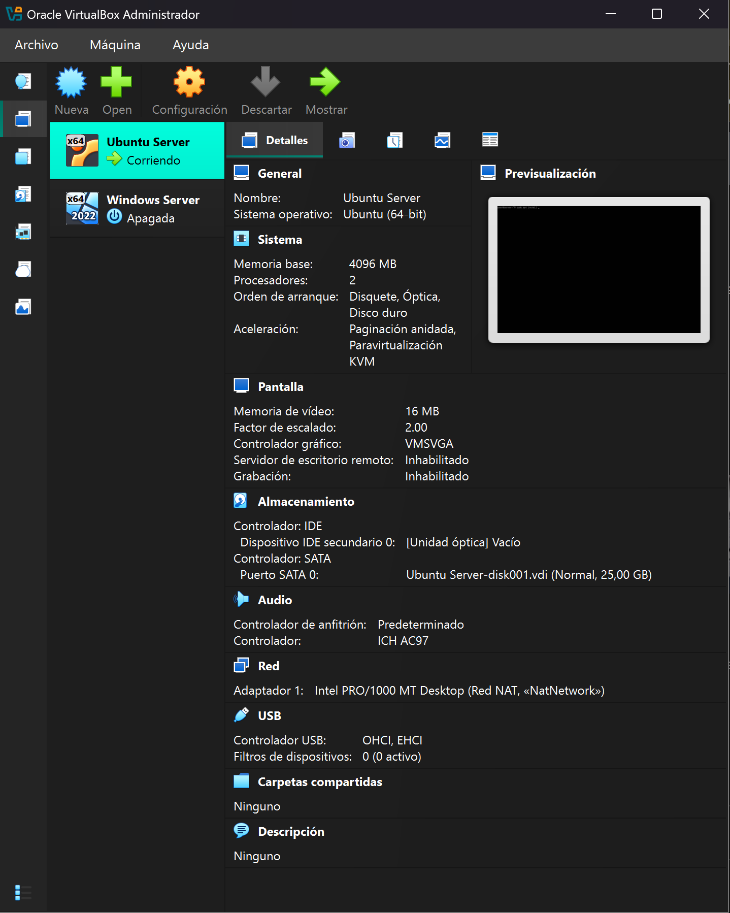

Ip maquina client:
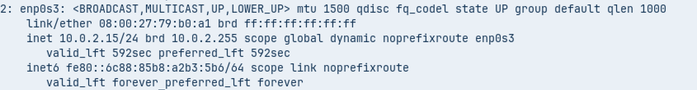

Ip maquina server:
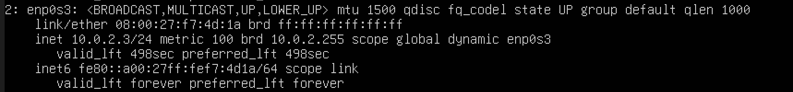

Prova de conectivitat
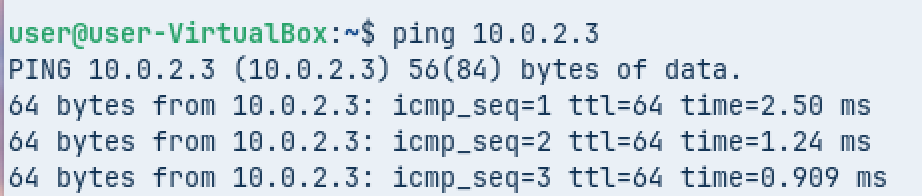

---

## 1. Instal·lació i Configuració base


Abans de fer qualsevol cosa, actualitzarem la màquina amb:
```bash
sudo apt update && sudo apt upgrade -y
```

Ara instal·larem Apache2 amb:
```bash
sudo apt install apache2
```

Per comprovar que Apache està funcionant correctament:
```bash
systemctl status apache2
```

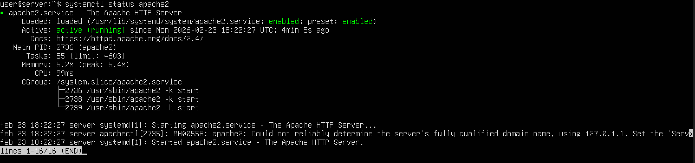

Comprovem que l’usuari i el grup www-data s’han creat amb:

```bash
grep www-data /etc/passwd
```

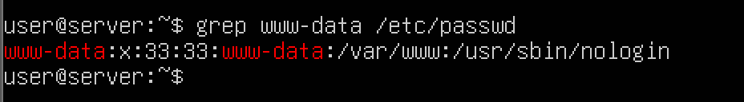

Revisem que la carpeta /var/www tingui permisos de lectura per a tots els usuaris, excepte root:

```bash
ls -l /var
```

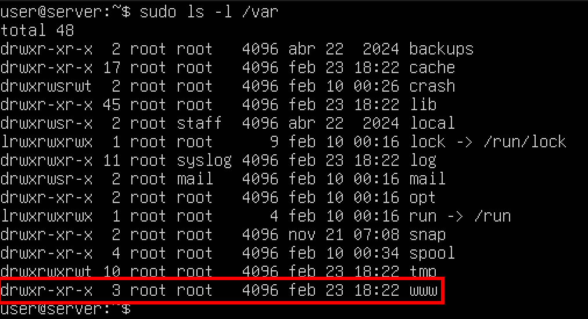

---

## 2. DNS

Per començar, editarem l’arxiu /etc/hosts per afegir els 2 dominis:

```bash
sudo nano /etc/hosts
```

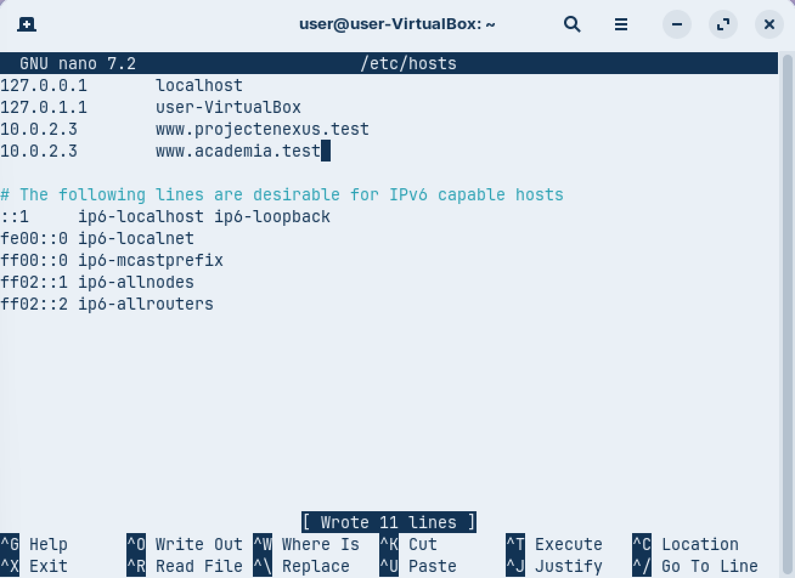

---

## 3. Desplegament de VirtualHosts

A continuació, crearem els directoris necessaris a /var/www per allotjar els 2 llocs per separat de manera organitzada:

```bash
sudo mkdir /var/www/projectenexus
sudo mkdir /var/www/academia
```

També haurem de crear un arxiu index.html dins de cada carpeta, aquest arxiu index.html sera la nostra pagina web(podem demanar a chatgpt el codi html per el index):

```bash
sudo nano /var/www/projectenexus/index.html
sudo nano /var/www/academia/index.html
```

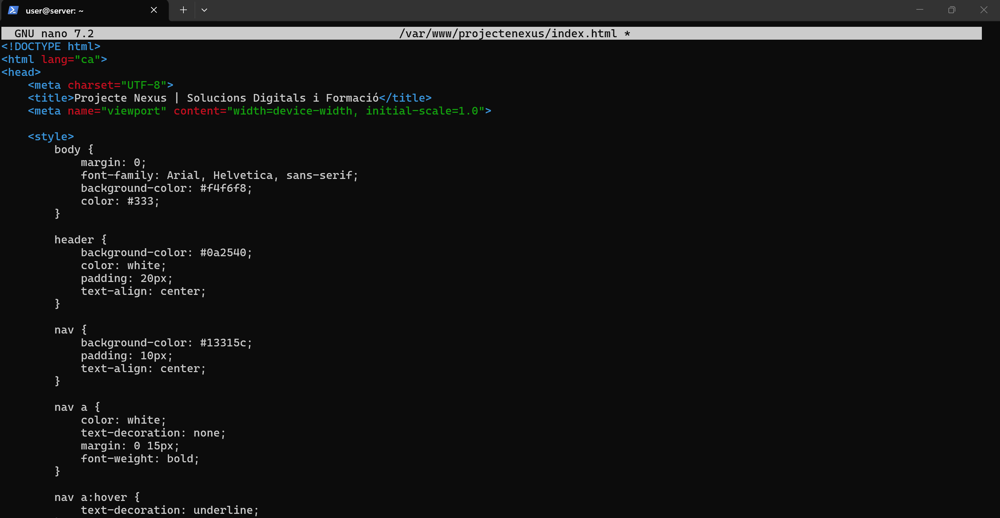  
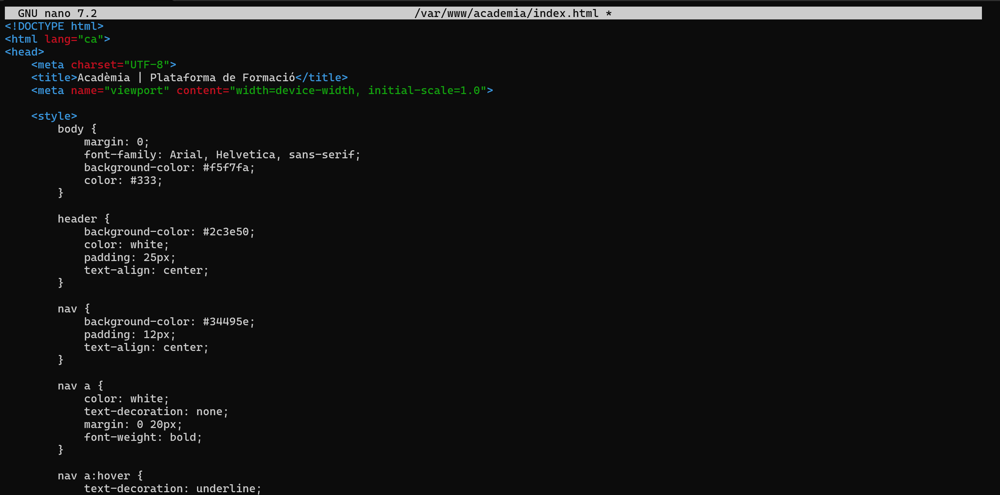

Configurarem 2 VirtualHosts a /etc/apache2/sites-available/. Copiarem l’arxiu de configuració per defecte així:

```bash
sudo cp /etc/apache2/sites-available/000-default.conf /etc/apache2/sites-available/projectenexus.conf
sudo cp /etc/apache2/sites-available/000-default.conf /etc/apache2/sites-available/academia.conf
```

Editarem els arxius de configuració amb:

```bash
sudo nano /etc/apache2/sites-available/projectenexus.conf
sudo nano /etc/apache2/sites-available/academia.conf
```

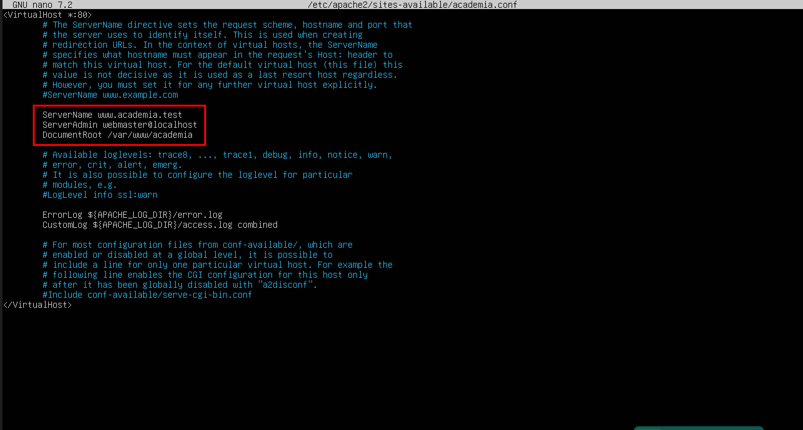  
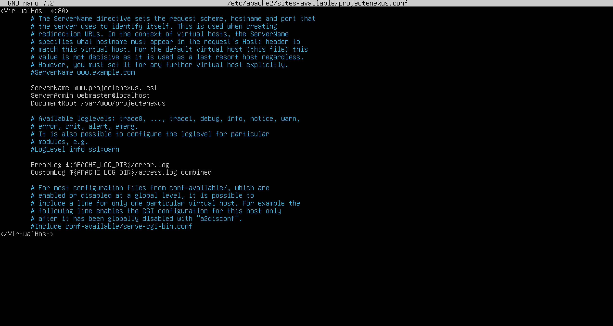

Ara carregarem els sites que hem creat amb:

```bash
sudo a2ensite projectenexus.conf
sudo a2ensite academia.conf
```

Haurem de recarregar el servei perquè les pàgines carreguin:

```bash
sudo systemctl reload apache2
```

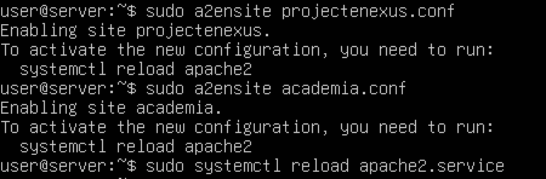

Pàgina de Projectenexus:  
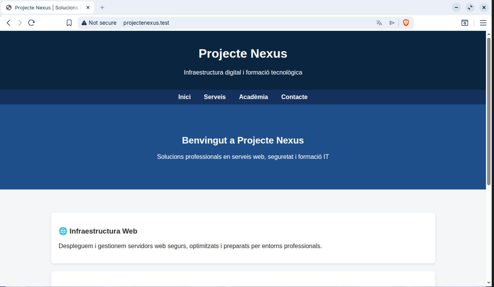

Pàgina d’Academia:  
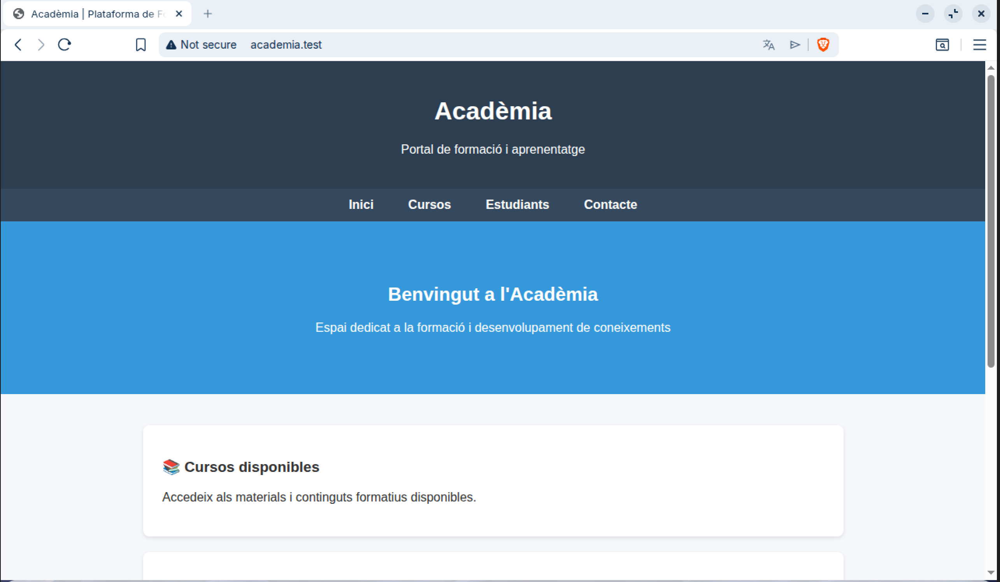

---

## 4. Personalització d'Errors

Per poder posar una pàgina d’error 404 personalitzada, haurem de crear un arxiu 404.html:

```bash
sudo nano /var/www/projectenexus/404.html
sudo nano /var/www/academia/404.html
```

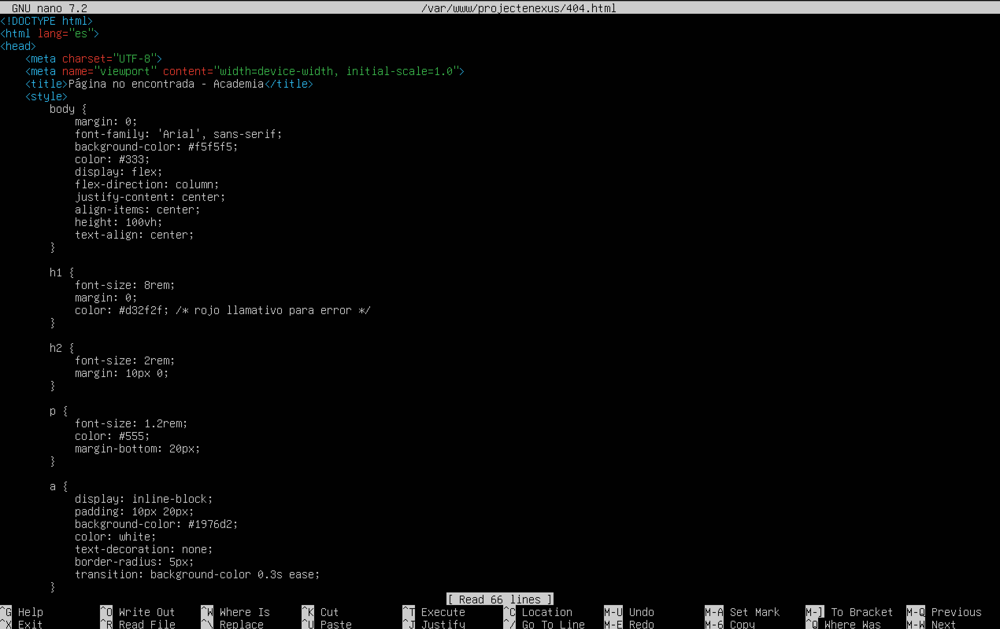  
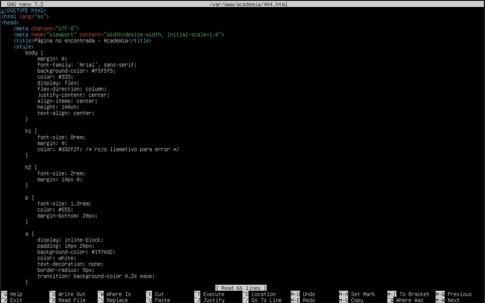

Perquè, en cas d’error 404, la nostra web carregui l’arxiu que acabem de crear, haurem de canviar la configuració del nostre site:

```bash
sudo nano /etc/apache2/sites-available/projectenexus.conf
sudo nano /etc/apache2/sites-available/academia.conf
```

  
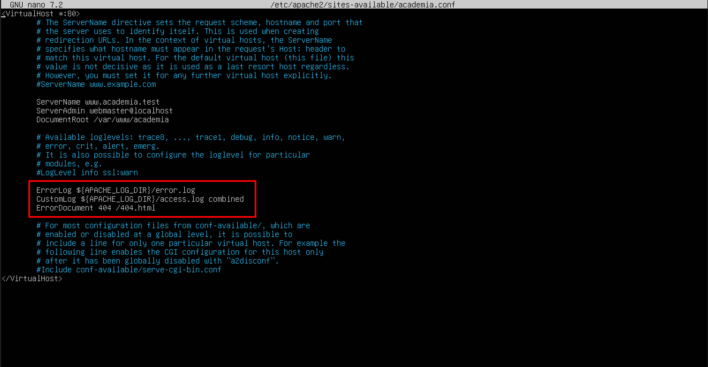

Error 404 projectenexus:  
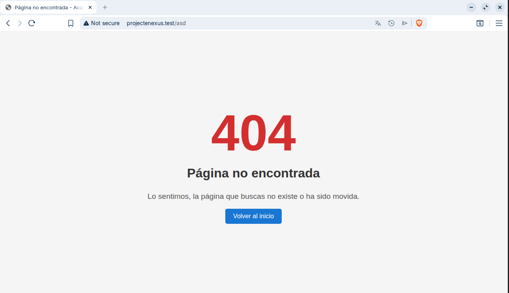

Error 404 academia:  
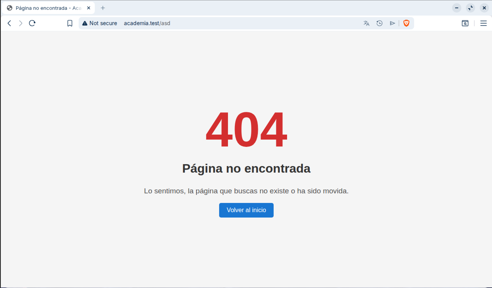

---

## 5. SSL (HTTPS)

Per poder habilitar diferents llocs amb pàgina segura (SSL), copiarem l’arxiu per defecte TLS:

```bash
sudo cp /etc/apache2/sites-available/default-ssl.conf /etc/apache2/sites-available/projectenexus-ssl.conf
sudo cp /etc/apache2/sites-available/default-ssl.conf /etc/apache2/sites-available/academia-ssl.conf
```

Ara crearem les carpetes on guardarem les claus del certificat autosignat que utilitzarem:

```bash
sudo mkdir /var/www/projectenexus/cert && sudo mkdir /var/www/projectenexus/private
sudo mkdir /var/www/academia/cert && sudo mkdir /var/www/academia/private
```

Per crear un certificat autosignat per als dominis projectenexus.test i academia.test utilitzarem OpenSSL. El certificat haurà de tenir una duració de 365 dies i una clau RSA de 2048 bits.

**Només es mostrarà la creació i aplicació de la clau per Projecte Nexus. Cal repetir el procés per Academia.**

```bash
sudo openssl req -x509 -nodes -days 365 -newkey rsa:2048 -keyout /var/www/projectenexus/private/projectenexus.key -out /var/www/projectenexus/cert/projectenexus.crt
```

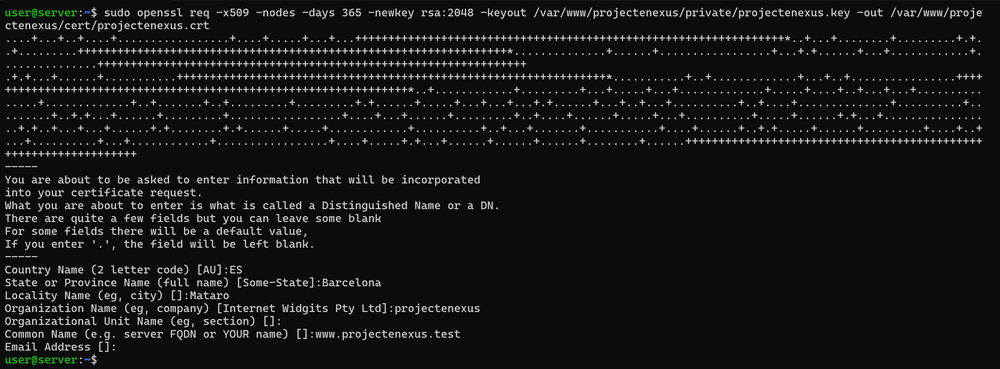

A continuació, haurem d’editar l’arxiu projectenexus-ssl.conf:

```bash
sudo nano /etc/apache2/sites-available/projectenexus-ssl.conf
```

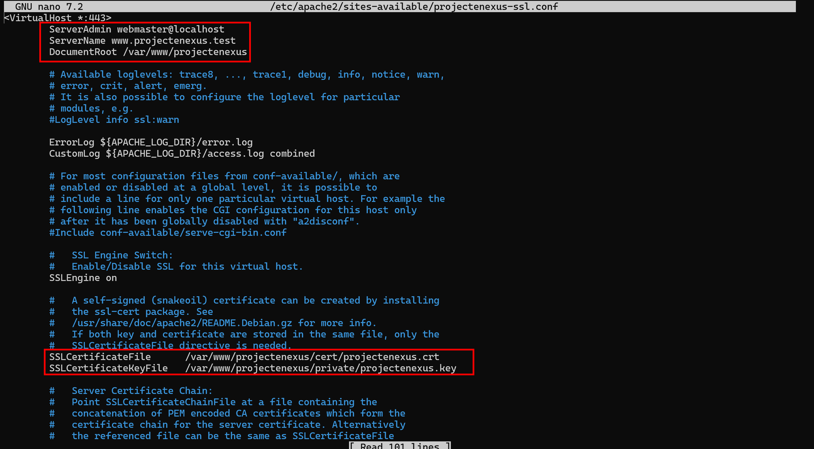

Per habilitar el protocol HTTPS en Apache2 cal fer:

```bash
sudo a2enmod ssl
sudo a2ensite projectenexus-ssl.conf
sudo systemctl restart apache2
```

**La comanda ``A2ensite`` tambe s'ha de fer amb l'arxiu d' academia**

## 6. Redirecció HTTPS

Ara configurarem el servidor perquè qualsevol petició HTTP es redirigeixi automàticament a HTTPS:

```bash
sudo nano /etc/apache2/sites-available/projectenexus.conf
```

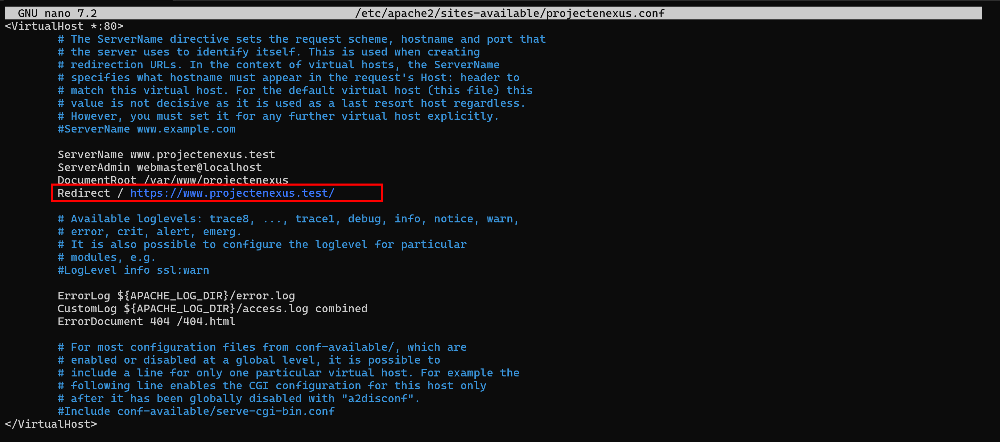

Recarregarem la configuració d’Apache2 amb:

```bash
sudo systemctl reload apache2
```

Com podrem veure, a partir d’ara quan posem www.projectenexus.test anirà per connexió segura mitjançant HTTPS:

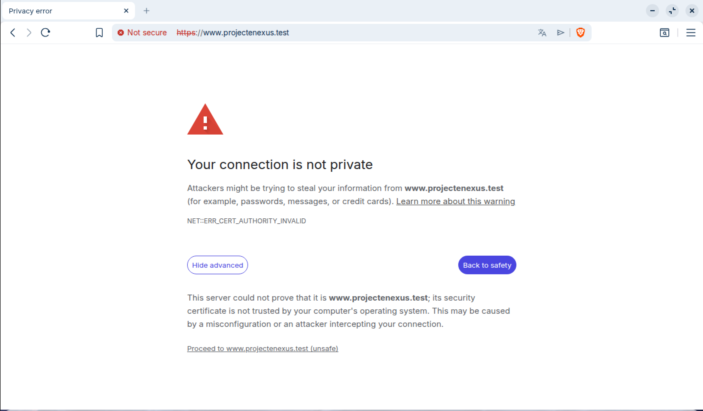  
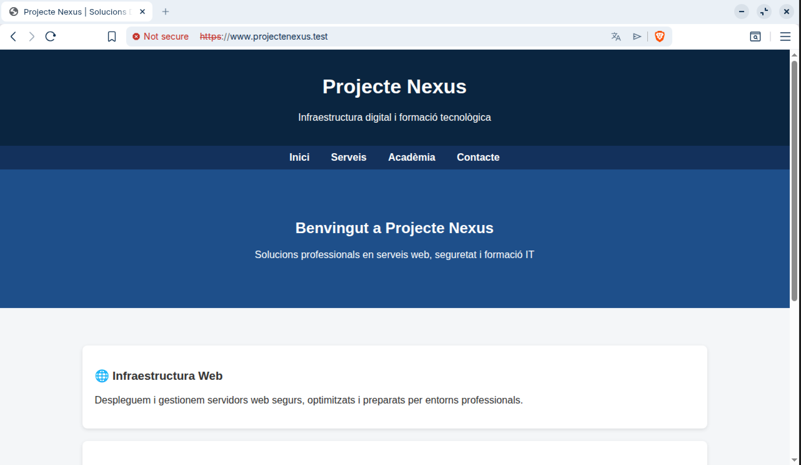

Ara ensenyaré el resultat d’Academia:

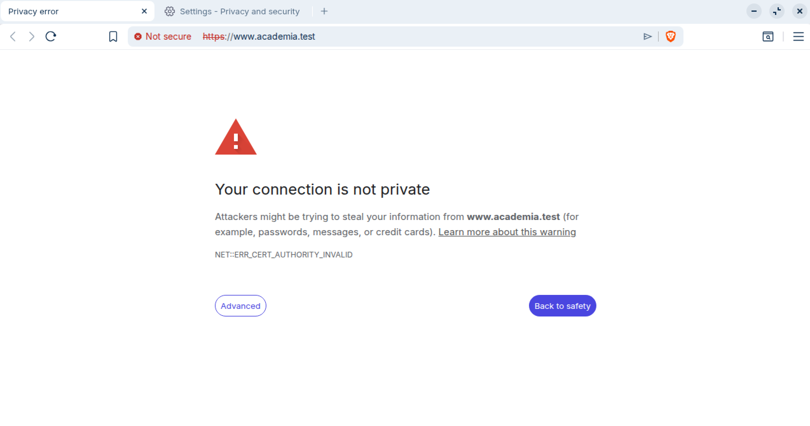  
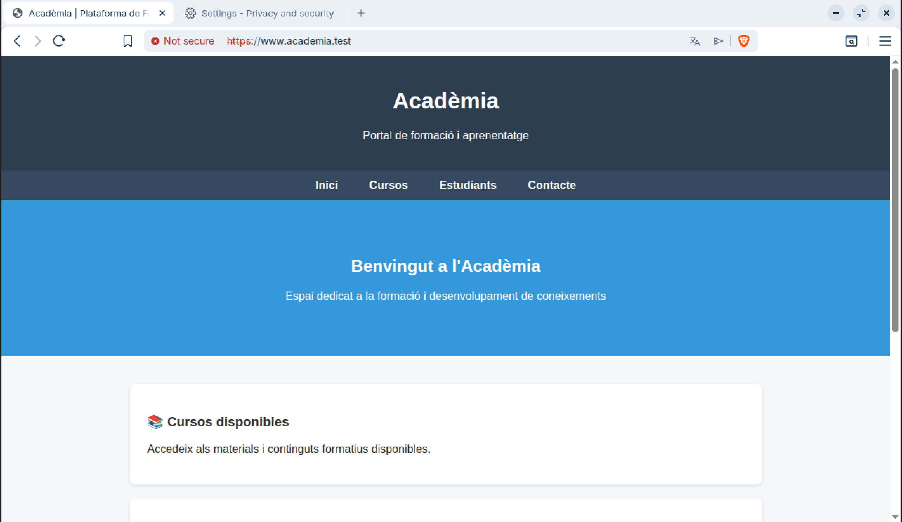

Ara necessitem bloquejar la carpeta private, perquè no és convenient que qualsevol persona pugui accedir-hi i, d’aquesta manera, obtenir la clau privada. Per fer això, editarem l’arxiu projectenexus-ssl.conf:

```bash
sudo nano /etc/apache2/sites-available/projectenexus-ssl.conf
```

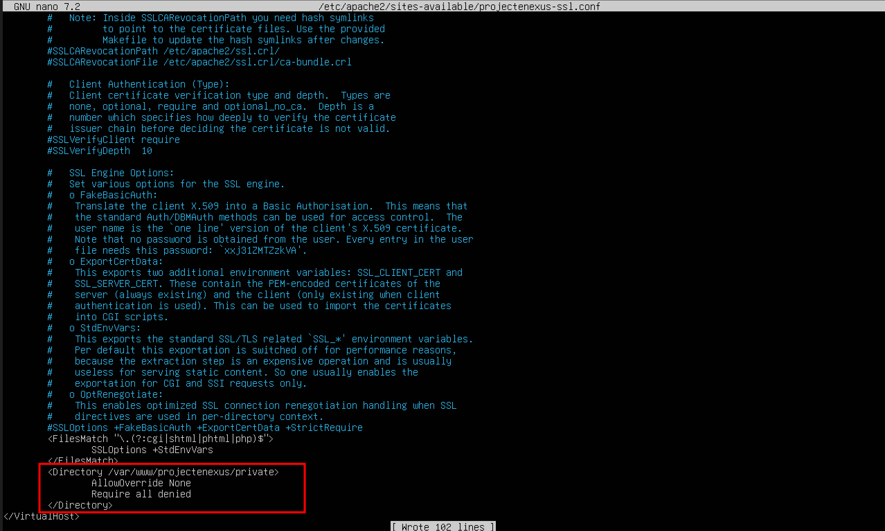

Recarregarem la configuració d’Apache2 amb:

```bash
sudo systemctl reload apache2
```

Com podem veure, no podem accedir al directori private a projectenexus.test:

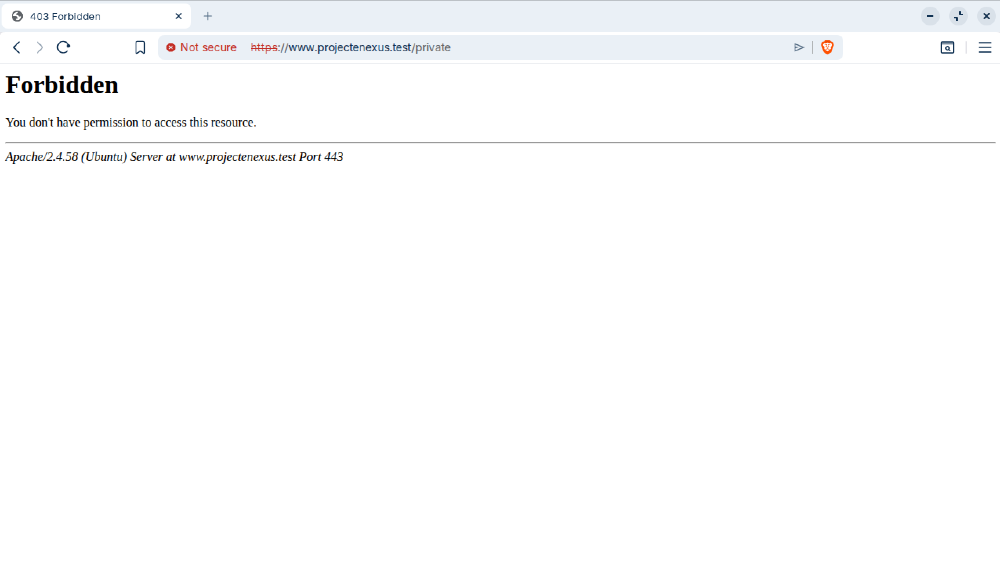

Ara mostraré com tampoc es pot accedir a academia:


---

## 7. Optimització amb HTTP/2

Per millorar la latència i la velocitat de càrrega de la web segura, habilitarem HTTP/2:

```bash
sudo a2enmod http2
sudo systemctl restart apache2
```

Canviarem la configuració de l’arxiu projectenexus-ssl.conf i afegirem la següent línia:

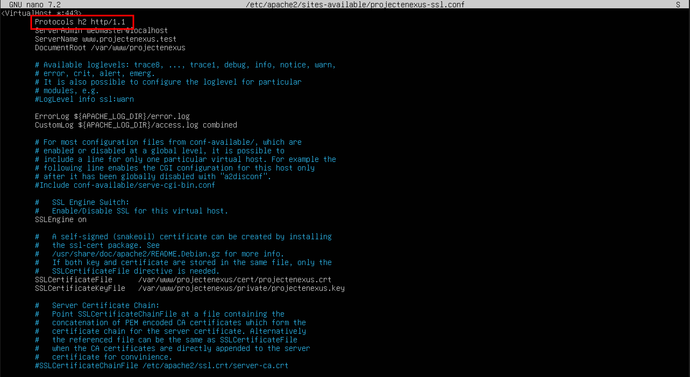

Recarregarem la configuració d’Apache2 amb:

```bash
sudo systemctl reload apache2
```

Per comprovar que respon amb el nou protocol farem:

```bash
curl -I -k -http2 https://10.0.2.3
```

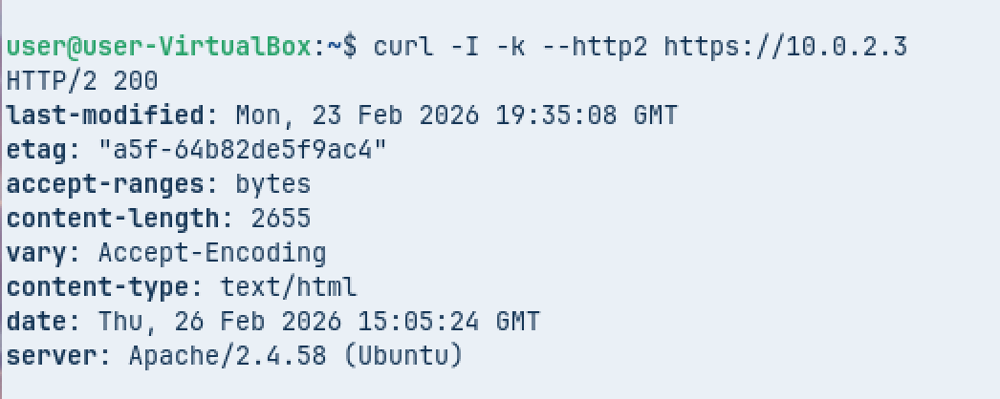