#  NGINX

## 0. Previ

Maquina client
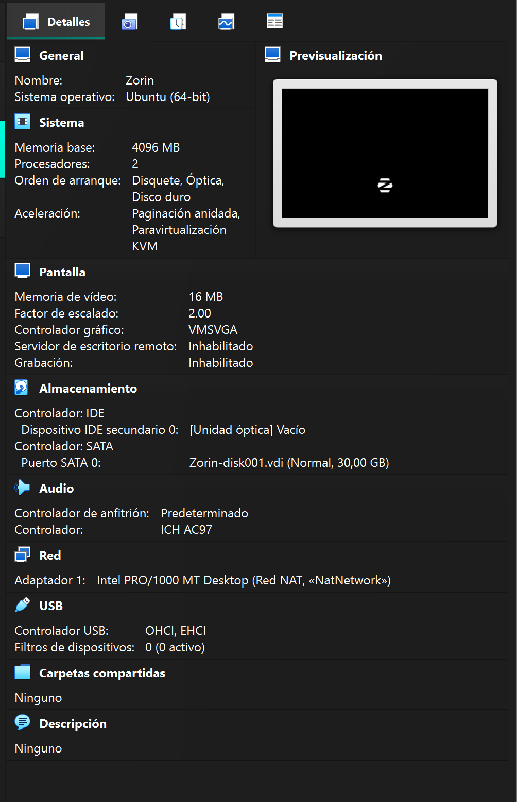

Maquina Virtual
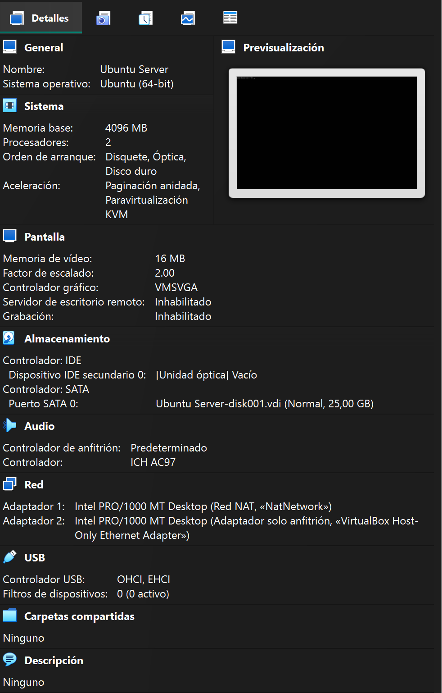

Ip Server
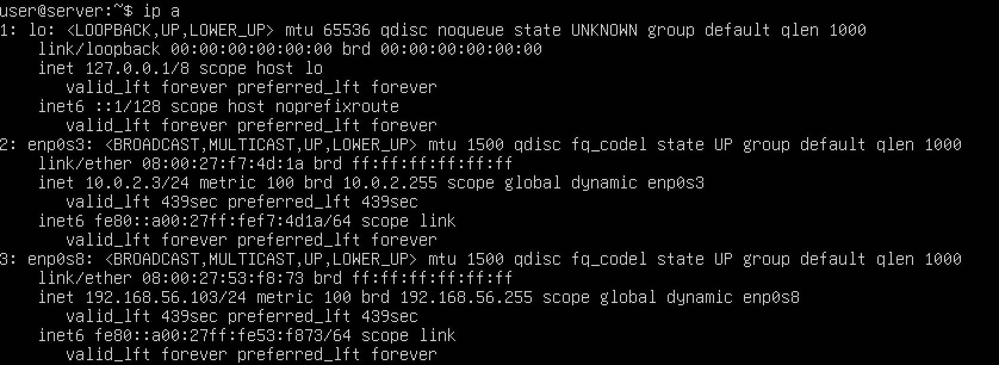

Ip client
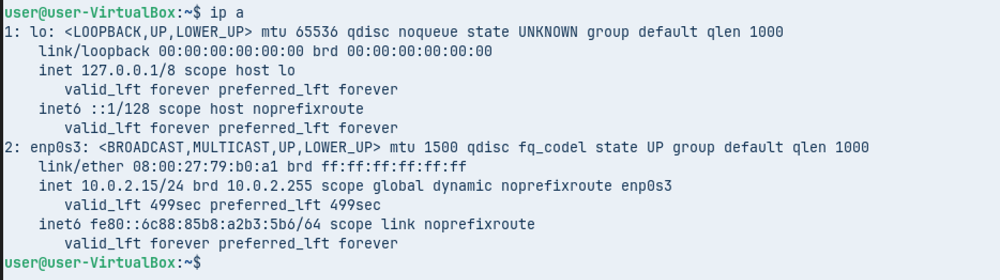

Prova de conectivitat
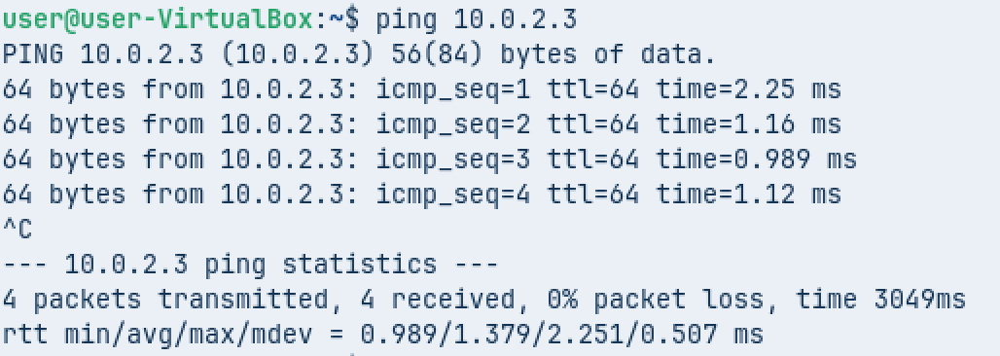

## 1.Instal·lació i Base

Per començar pararem i desahbilitarem apache2 per que el servei fa conflicte amb nginx
```bash
sudo systemctl stop apache2
sudo systemctl disable apache2
```

Instal·lem Ngnix 
```bash
sudo apt install nginx -y
```

Comprovem l'estat de nginx amb:
```bash
sudo systemctl status nginx
```
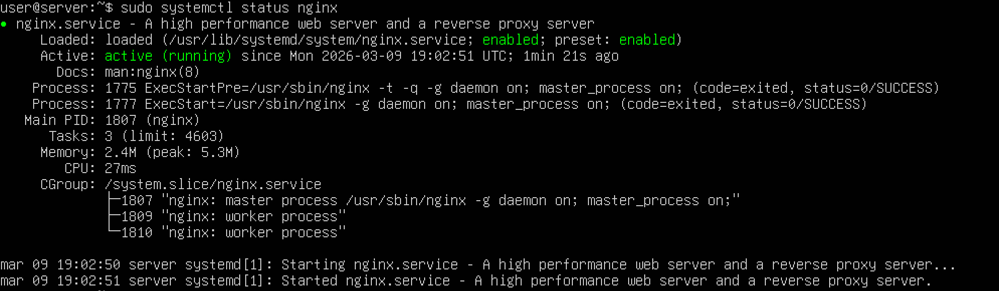

## 2. Server Blocks

A continuació copiarem el arxiu default del server
```bash
sudo cp /etc/ngnix/sites-available/default /etc/nginx/sites-available/projectenexus
sudo cp /etc/ngnix/sites-available/default /etc/nginx/sites-available/academia
```

Editarem els arxius default que acabem de crear
```bash
sudo nano /etc/nginx/sites-available/projectenexus
sudo nano /etc/nginx/sites-available/academia
```
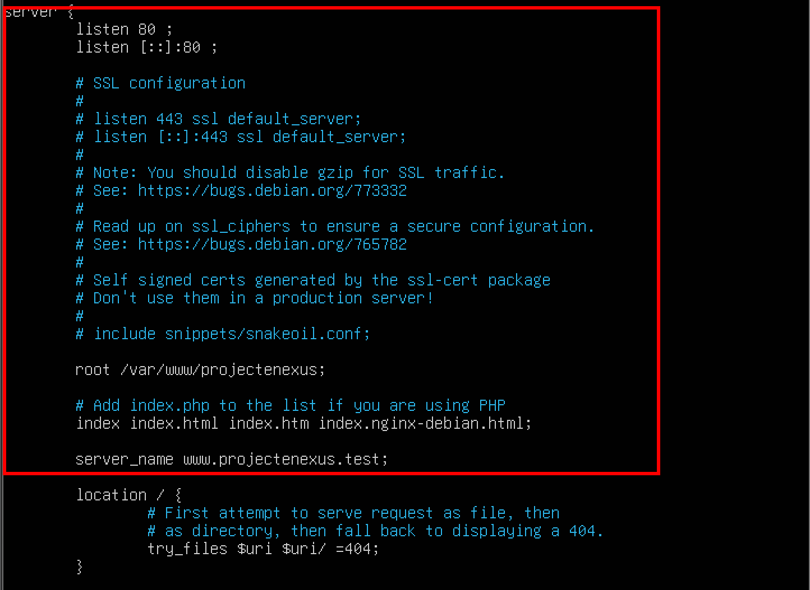
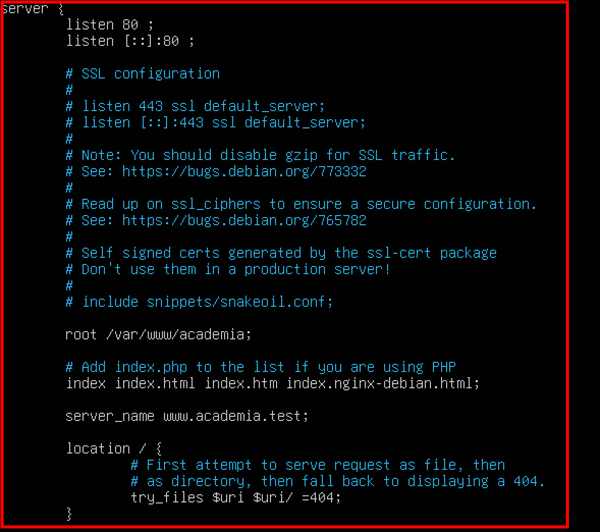

Ara haurem de crear un enllaç simbolic
```bash
sudo ln -s /etc/nginx/sites-available/projectenexus /etc/nginx/sites-enabled/
sudo ln -s /etc/nginx/sites-available/academia /etc/nginx/sites-enabled/
```

Com treballarem amb diferents noms editarem l'arxiu /etc/nginx/nginx.conf esborrarem el #
```bash
sudo nano /etc/nginx/nginx.conf
```
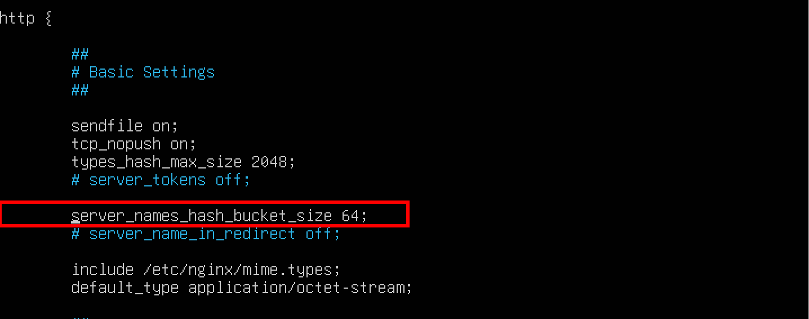

Per comprovar que no hi han errors sintactics a la configuració 
```bash
sudo nginx -t
```
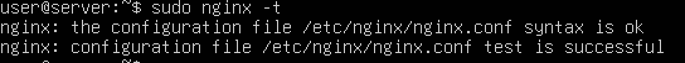

Reiniciarem el servei
```bash
sudo systemctl restart nginx
```

Pagina web projectenexus:
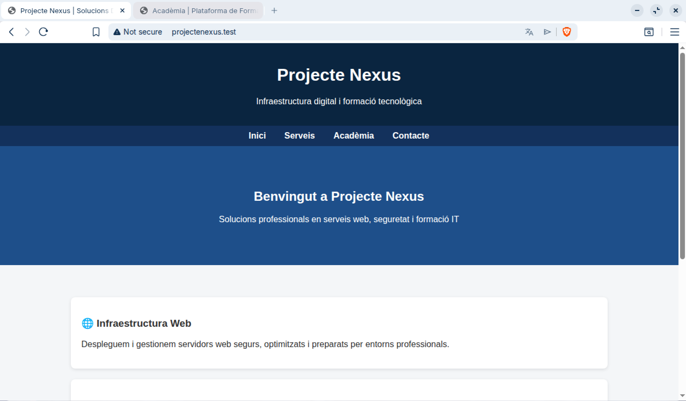

Pagina web academia:
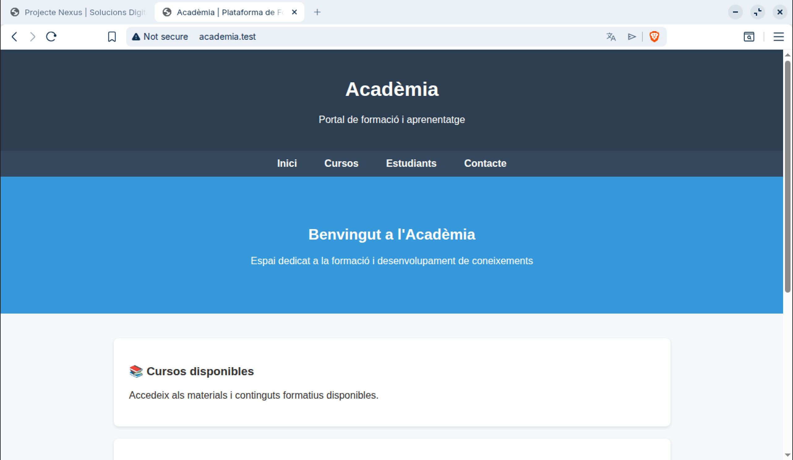

## 3. Pagina d'error 404

