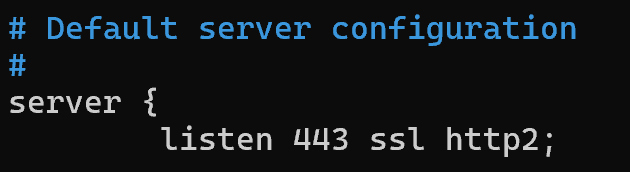
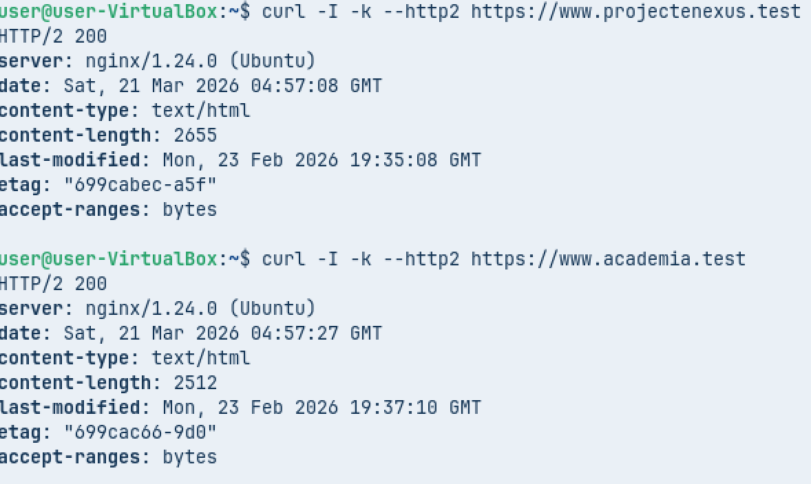

# NGINX

## 0. Previ

**Màquina client**\


**Màquina virtual**\


**IP del servidor**\


**IP del client**\


**Prova de connectivitat**\


------------------------------------------------------------------------

## 1. Instal·lació i configuració base

Per començar, aturarem i deshabilitarem **Apache2**, ja que aquest
servei pot entrar en conflicte amb **Nginx**.

``` bash
sudo systemctl stop apache2
sudo systemctl disable apache2
```

Instal·lem **Nginx**:

``` bash
sudo apt install nginx -y
```

Comprovem l'estat del servei:

``` bash
sudo systemctl status nginx
```


------------------------------------------------------------------------

## 2. Server Blocks

A continuació copiarem l'arxiu **default** del servidor per crear dues
configuracions noves.

``` bash
sudo cp /etc/nginx/sites-available/default /etc/nginx/sites-available/projectenexus
sudo cp /etc/nginx/sites-available/default /etc/nginx/sites-available/academia
```

Editarem els arxius que acabem de crear:

``` bash
sudo nano /etc/nginx/sites-available/projectenexus
sudo nano /etc/nginx/sites-available/academia
```

\


Ara crearem els **enllaços simbòlics** per habilitar els llocs web:

``` bash
sudo ln -s /etc/nginx/sites-available/projectenexus /etc/nginx/sites-enabled/
sudo ln -s /etc/nginx/sites-available/academia /etc/nginx/sites-enabled/
```

Com que treballarem amb diferents noms de domini, editarem l'arxiu
`/etc/nginx/nginx.conf` i descomentarem la línia corresponent (eliminant
el `#`).

``` bash
sudo nano /etc/nginx/nginx.conf
```


Per comprovar que no hi ha errors sintàctics a la configuració:

``` bash
sudo nginx -t
```


Reiniciem el servei:

``` bash
sudo systemctl restart nginx
```

**Pàgina web projectenexus:**\


**Pàgina web academia:**\


------------------------------------------------------------------------

## 3. Pàgina d'error 404

Per personalitzar la nostra pàgina d'error **404**, haurem d'accedir als
arxius de configuració:

``` bash
sudo nano /etc/nginx/sites-available/projectenexus
sudo nano /etc/nginx/sites-available/academia
```

\


Comprovem que no hi hagi errors sintàctics:

``` bash
sudo nginx -t
```

Reiniciem el servei:

``` bash
sudo systemctl restart nginx
```

**Pàgina d'error projectenexus:**\
\


**Pàgina d'error academia:**\
\


------------------------------------------------------------------------

## 4. SSL (HTTPS)

Ara passarem de **HTTP a HTTPS**. Per començar copiarem els arxius de
configuració i els afegirem l'extensió `.tls`.

``` bash
cd /etc/nginx/sites-available/

sudo cp projectenexus projectenexus.tls
sudo cp academia academia.tls
```

Editarem els arxius i afegirem la configuració corresponent:

``` bash
sudo nano /etc/nginx/sites-available/projectenexus.tls
sudo nano /etc/nginx/sites-available/academia.tls
```

\


**Els certificats es creen de la mateixa manera que a la guia
d'Apache.**

Si tot és correcte, crearem els enllaços simbòlics per habilitar els
llocs:

``` bash
sudo ln -s /etc/nginx/sites-available/projectenexus.tls /etc/nginx/sites-enabled/projectenexus.tls
sudo ln -s /etc/nginx/sites-available/academia.tls /etc/nginx/sites-enabled/academia.tls
```

Comprovem la configuració:

``` bash
sudo nginx -t
```


Reiniciem el servei:

``` bash
sudo systemctl restart nginx
```

**Pàgina projectenexus (HTTPS):**\


**Pàgina academia (HTTPS):**\


------------------------------------------------------------------------

## 5. Protecció de carpetes

Per protegir la carpeta **private**, afegirem la configuració
corresponent a **cada arxiu de configuració**:

``` bash
sudo nano /etc/nginx/sites-available/projectenexus.tls
sudo nano /etc/nginx/sites-available/academia.tls
```


Reiniciem el servei:

``` bash
sudo systemctl restart nginx
```

Si intentem accedir-hi, apareixerà el missatge **Forbidden**.

**projectenexus:**\


**academia:**\


------------------------------------------------------------------------

## 6. Redirecció HTTPS

Per fer la redirecció a **HTTPS**, haurem d'editar els arxius de
configuració de la següent manera.

⚠️ **Ha de quedar exactament com es mostra, sense afegir res més.**

``` bash
sudo nano /etc/nginx/sites-available/projectenexus.tls
sudo nano /etc/nginx/sites-available/academia.tls
```

\


Reiniciem el servei:

``` bash
sudo systemctl restart nginx
```

Comprovarem que la connexió es realitza correctament utilitzant
**curl**:

``` bash
curl http://www.projectenexus.test
curl http://www.academia.test
```

\


------------------------------------------------------------------------

## 7. Optimització HTTP/2

**Nginx és compatible amb HTTP/2**, per tant només hem d'editar la
següent línia al nostre arxiu de configuració:

``` bash
sudo nano /etc/nginx/sites-available/projectenexus.tls
sudo nano /etc/nginx/sites-available/academia.tls
```



Reiniciem el servei:

``` bash
sudo systemctl restart nginx
```

Finalment comprovem que el servidor funciona amb **HTTP/2** utilitzant
**curl**:


