#  NGINX

## 0. Previ

Maquina client


Maquina Virtual


Ip Server


Ip client


Prova de conectivitat


## 1.Instal·lació i Base

Per començar pararem i desahbilitarem apache2 per que el servei fa conflicte amb nginx
```bash
sudo systemctl stop apache2
sudo systemctl disable apache2
```

Instal·lem Ngnix 
```bash
sudo apt install nginx -y
```

Comprovem l'estat de nginx amb:
```bash
sudo systemctl status nginx
```


## 2. Server Blocks

A continuació copiarem el arxiu default del server
```bash
sudo cp /etc/ngnix/sites-available/default /etc/nginx/sites-available/projectenexus
sudo cp /etc/ngnix/sites-available/default /etc/nginx/sites-available/academia
```

Editarem els arxius default que acabem de crear
```bash
sudo nano /etc/nginx/sites-available/projectenexus
sudo nano /etc/nginx/sites-available/academia
```


Ara haurem de crear un enllaç simbolic
```bash
sudo ln -s /etc/nginx/sites-available/projectenexus /etc/nginx/sites-enabled/
sudo ln -s /etc/nginx/sites-available/academia /etc/nginx/sites-enabled/
```

Com treballarem amb diferents noms editarem l'arxiu /etc/nginx/nginx.conf esborrarem el #
```bash
sudo nano /etc/nginx/nginx.conf
```


Per comprovar que no hi han errors sintactics a la configuració 
```bash
sudo nginx -t
```


Reiniciarem el servei
```bash
sudo systemctl restart nginx
```

Pagina web projectenexus:


Pagina web academia:


## 3. Pagina d'error 404

Per poder personalitzar la nostra pagina d'error 404 haurem de accedir l'arxiu de configuracion
```bash
sudo nano /etx/nginx/sites-available/projectenexus
sudo nano /etx/nginx/sites-available/academia
```
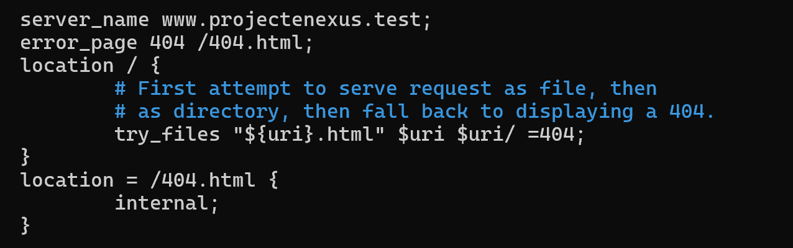
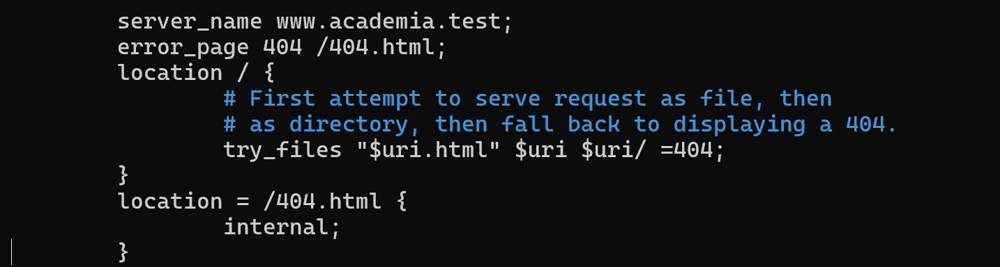

Per comprovar que no hi han errors sintactics a la configuració 
```bash
sudo nginx -t
```

Reiniciarem el servei
```bash
sudo systemctl restart nginx
```

Pagina error projectenexus:
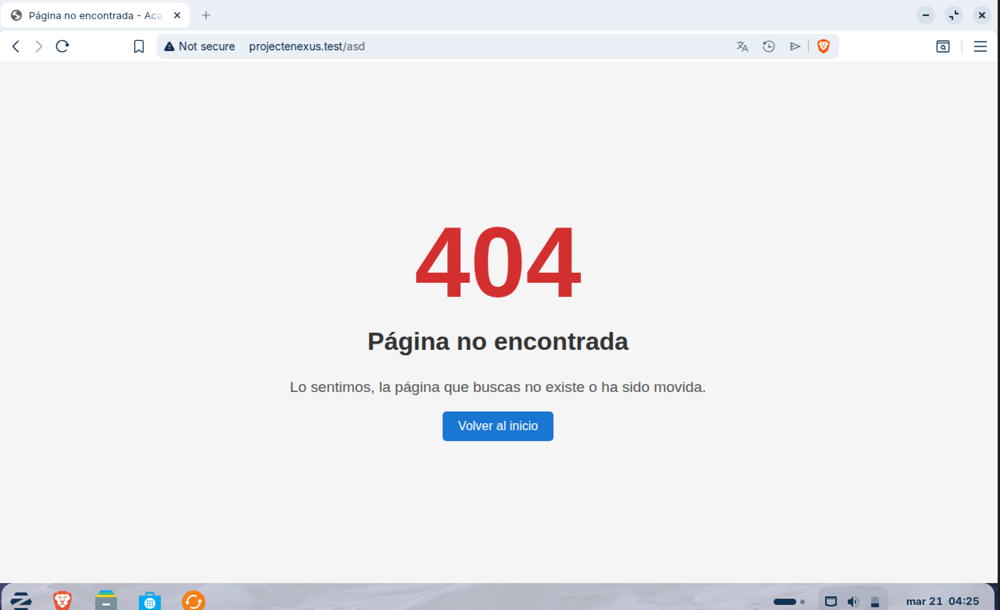
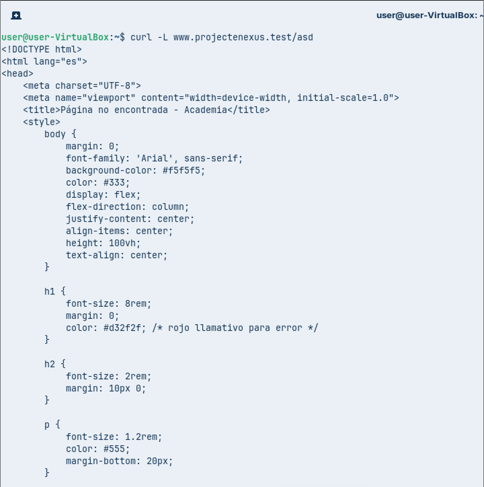

Pagina error academia:

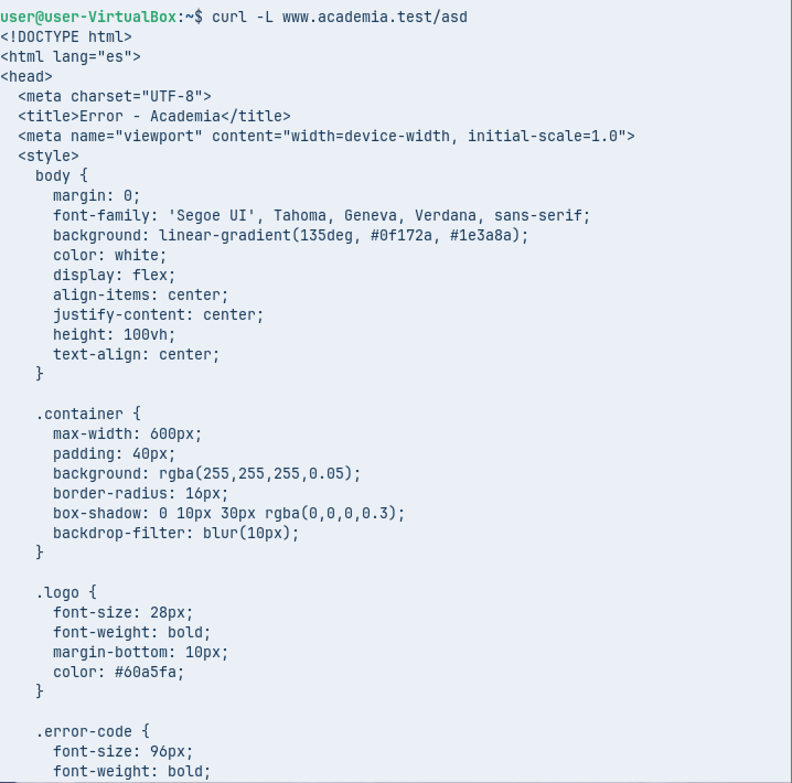

## 4. SSL (HTTPS)

Ara pasarem de HTTP a HTTPS per començar copiarem els arxius pero li posarem .tls al final
```bash
cd /etc/nginx/sites-available/
sudo cp projectenexus projectenexus.tls
sudo cp academia academia.tls
```

Editarem els arxius, posant la configuració correcta
```bash
sudo nano /etc/nginx/sites-available/projectenexus.tls
sudo nano /etc/nginx/sites-available/academia.tls
```
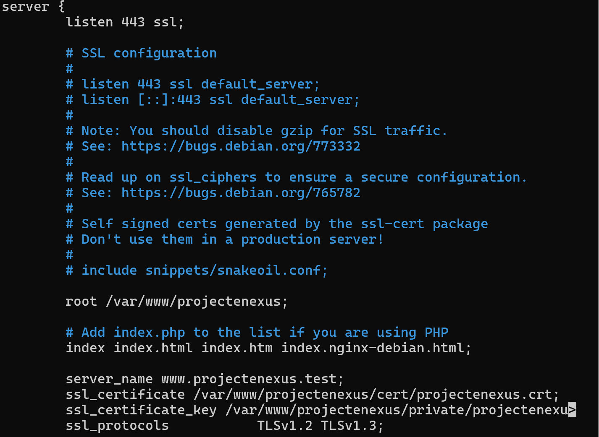
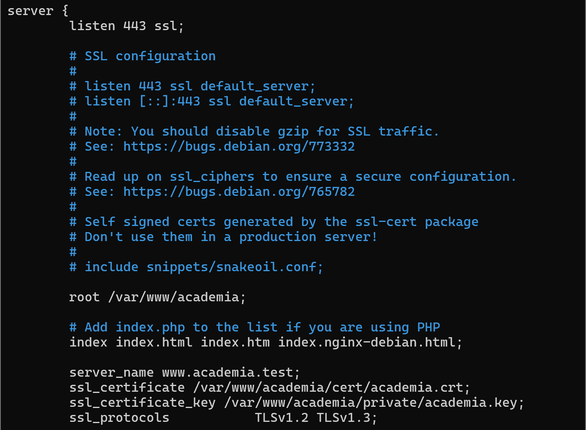

**ELS CERTIFICATS ES CREAN DE LA MATEIXA MANERA QUE A LA GUIA DE APACHE**

si esta tot correcte ara farem un enllaç simbolic per habilitar els sites
```bash
sudo ln -s /etc/nginx/sites-available/projectenexus.tls /etc/nginx/sites-enabled/projectenexus.tls
sudo ln -s /etc/nginx/sites-available/academia.tls /etc/nginx/sites-enabled/academia.tls
```

Per comprovar que no hi han errors sintactics a la configuració 
```bash
sudo nginx -t
```
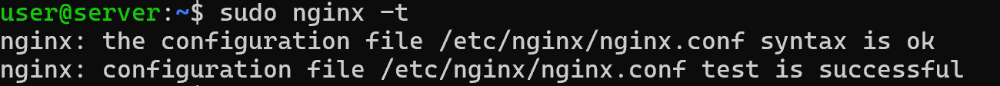

Reiniciarem el servei
```bash
sudo systemctl restart nginx
```

Pagina projectenexus(HTTPS):
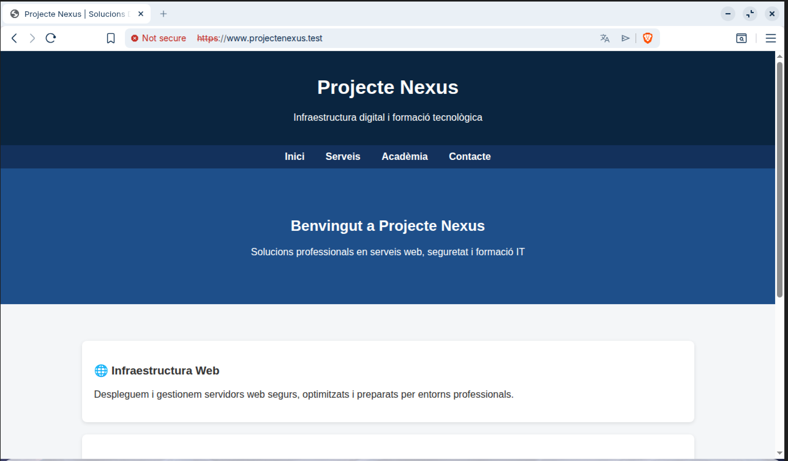

Pagina academia(HTTPS):
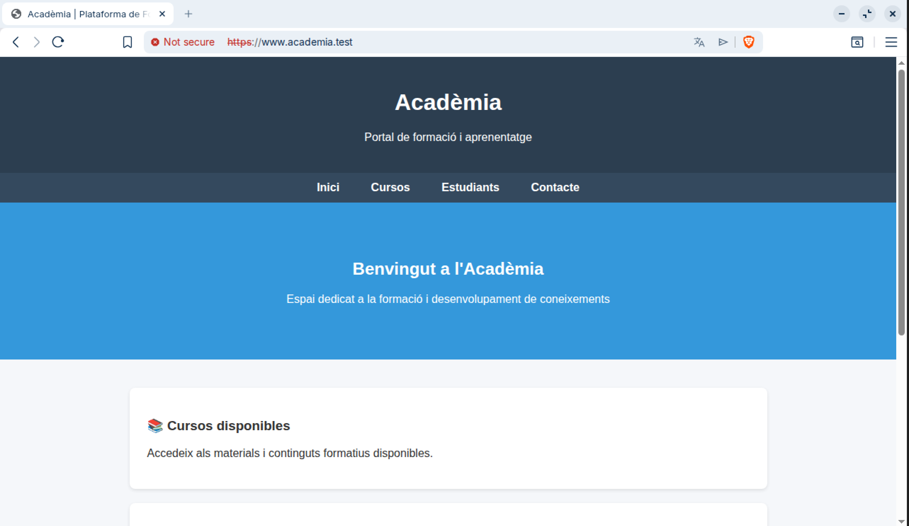

## 5. Protecció Carpetes

per protegir la carpeta private posarem la seguent linea a la configuració de **cada arxiu de configuració**
```bash
sudo nano /etc/nginx/sites-available/projectenexus.tls
sudo nano /etc/nginx/sites-available/academia.tls
```
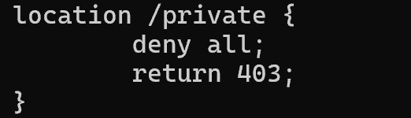

Reiniciarem el servei
```bash
sudo systemctl restart nginx
```

Com podem veure si intentem entrar posara forbiden

projectenexus:
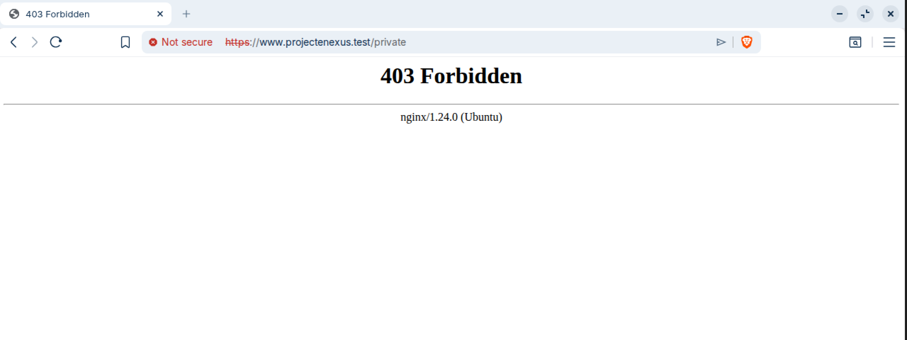

academia:
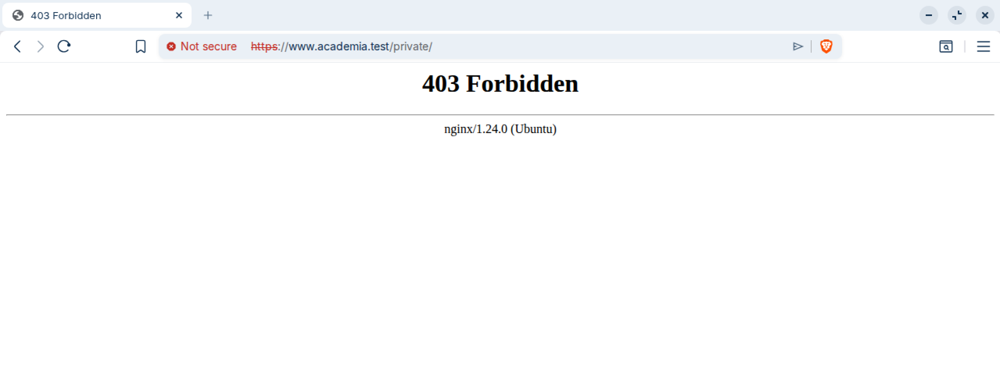

## 6. Redirecció HTTPS

Per fer la redireccio HTTPS haurem de editar el arxiu de configuració de la seguent manera
```bash
sudo nano /etc/nginx/sites-available/projectenexus.tls
sudo nano /etc/nginx/sites-available/academia.tls
```
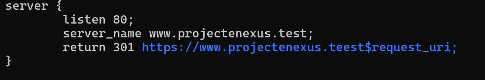
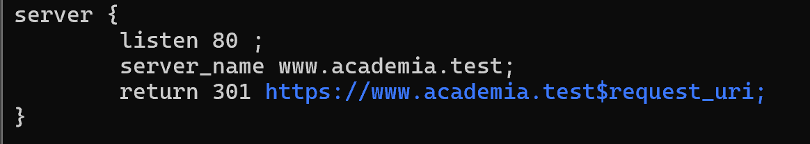

Reiniciarem el servei
```bash
sudo systemctl restart nginx
```

comprovarem que la conexio es fa de manera exitosa amb curl
```bash
curl http://www.projectenexus.test
curl http://www.academia.test
```
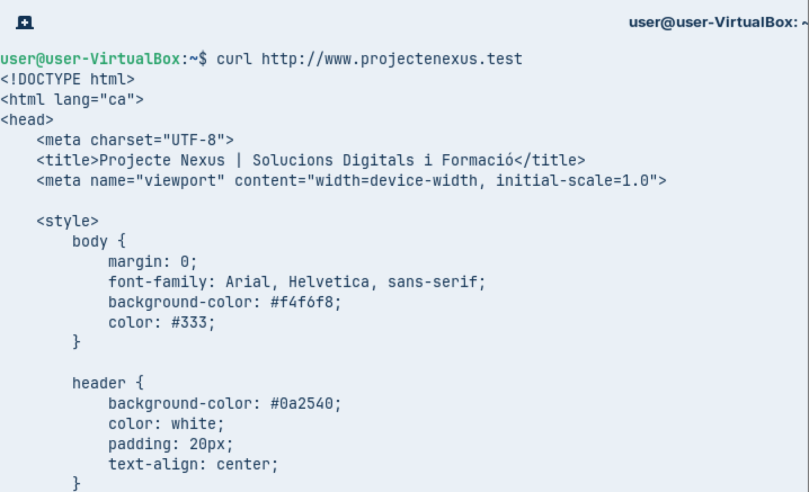
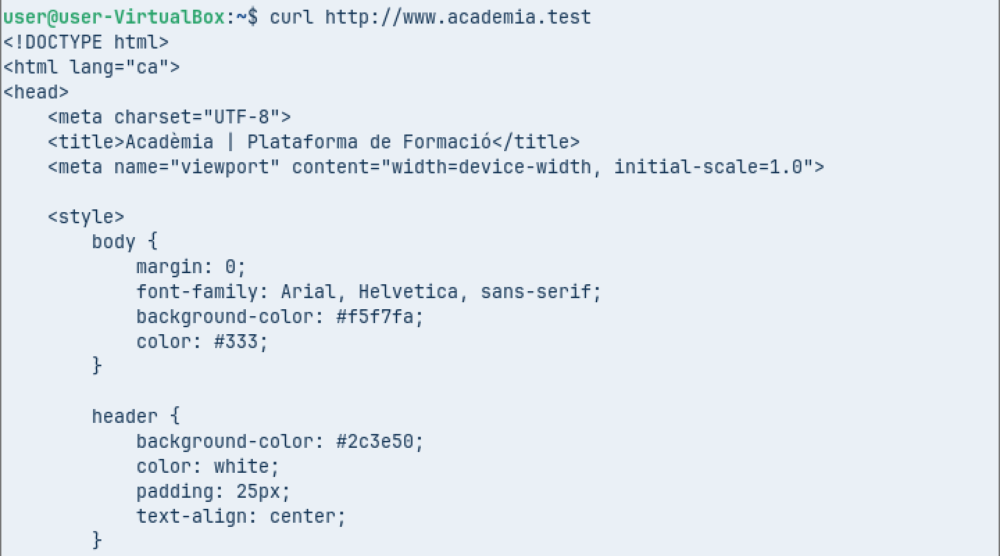