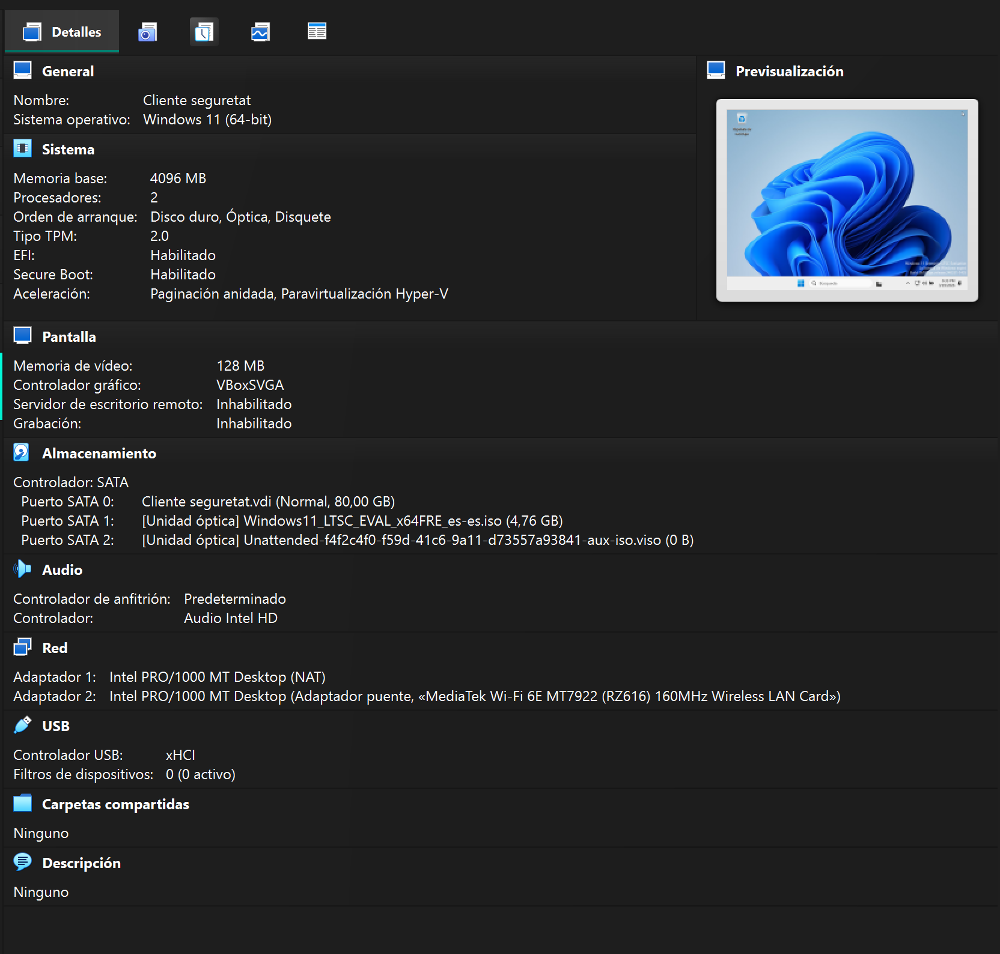
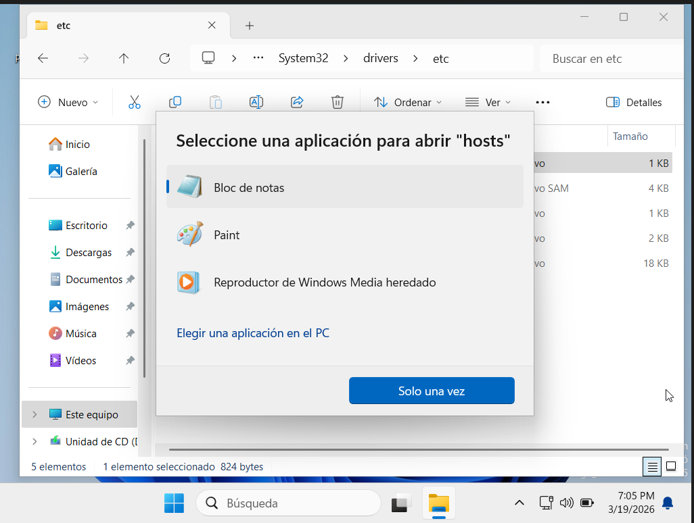

# MAQUINA CLIENT

## 0. Previ

2 adaptador de xarxa un en nat dhcp i l'altre pont per poder veure el server

ara cambiarem el DNS per que reconegui el nom del server amb la seva IP corresponent
anirem a aquesta ruta: C:\Windows\System32\drivers\etc i obrirem l'arxiu hosts amb el bloc de notes **AMB PERMISOS DE ADMINISTRADOR**
