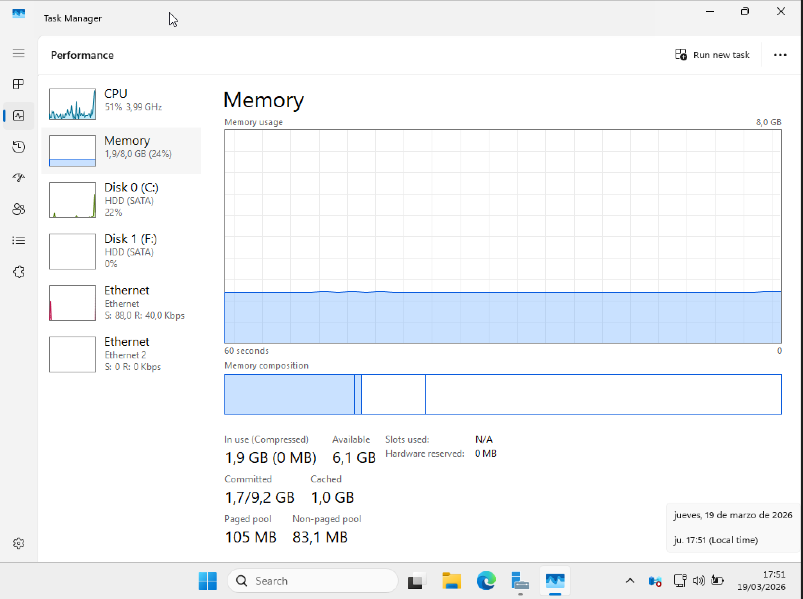
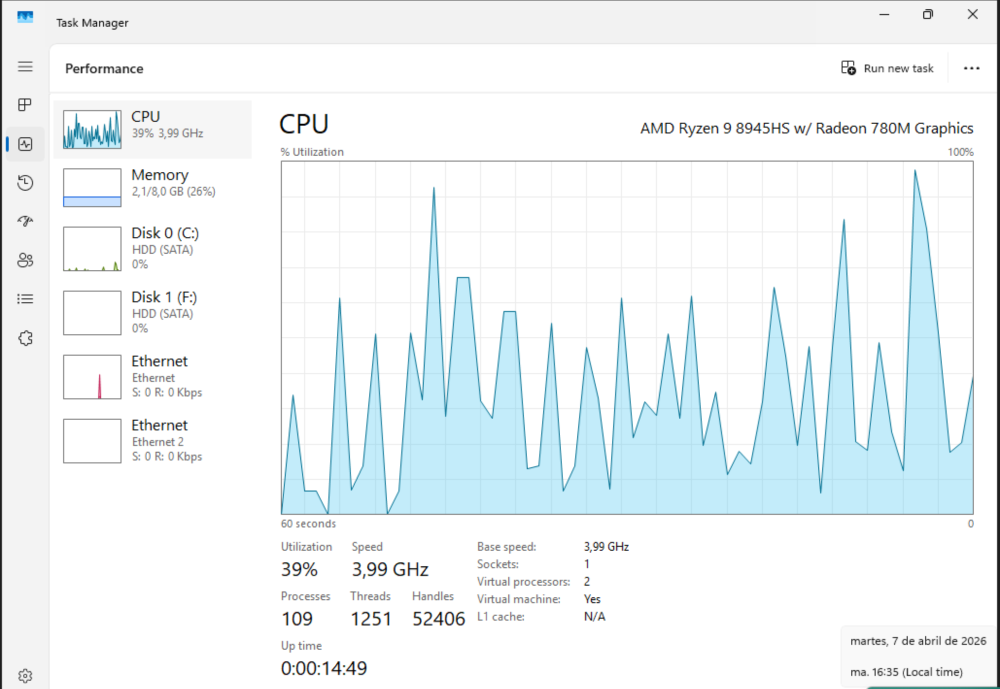
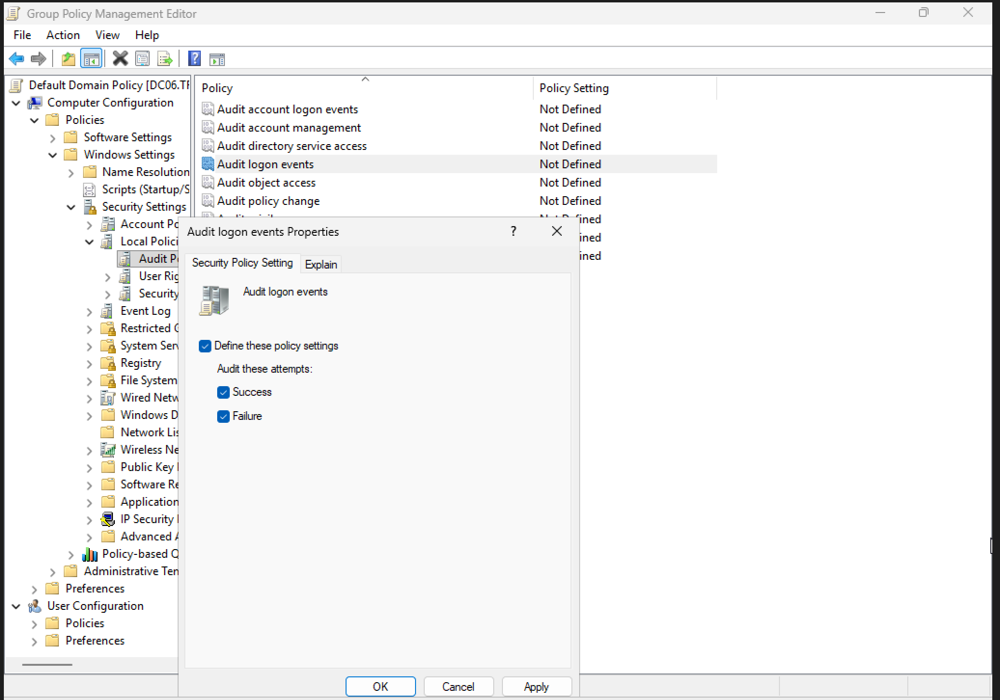
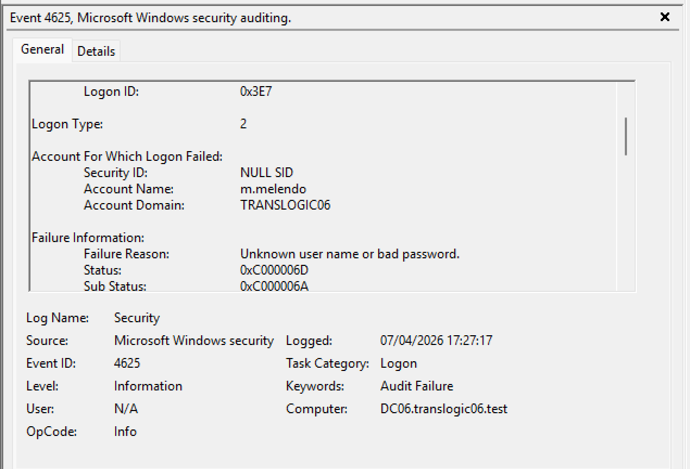
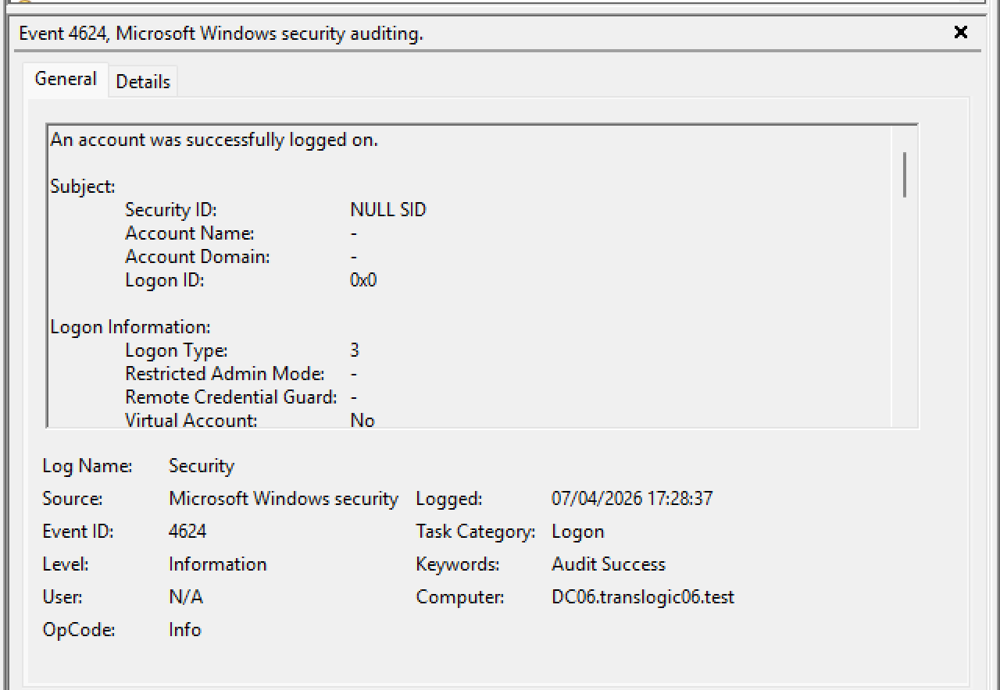

## 1. Monitorizació de recursos
Com podem veure aquesta es la quantitat de ram que esta gastant el nostre windows server també podem veure la quantitat de processador

El nostre window sserver esta gastant 2gb de ram del 8 que te i el processador no esta estressat el que vol dir que el nostre server te suficients recursos per els treballs sense estress

## 2. GPO 

Activem la GPO per auditar tots els intents d'inici de sessió i marcem que guardi tant els intents correctes com els fallats

intentarem iniciar sessio amb un usuari i possarem la contrasenya incorrecta i despres tornarem a iniciar sessio com a administrador, una vegada fet aixo anirem al event viewer i veurem els logs que ens ha donat la nostra GPO hauras de buscar una ID de event la quina es 4625

has 